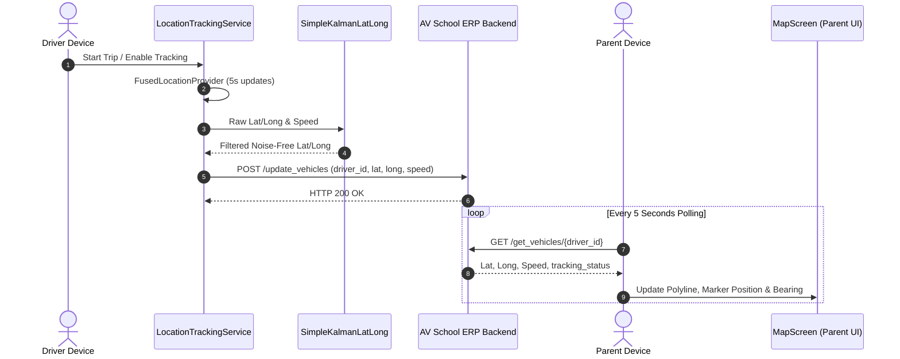
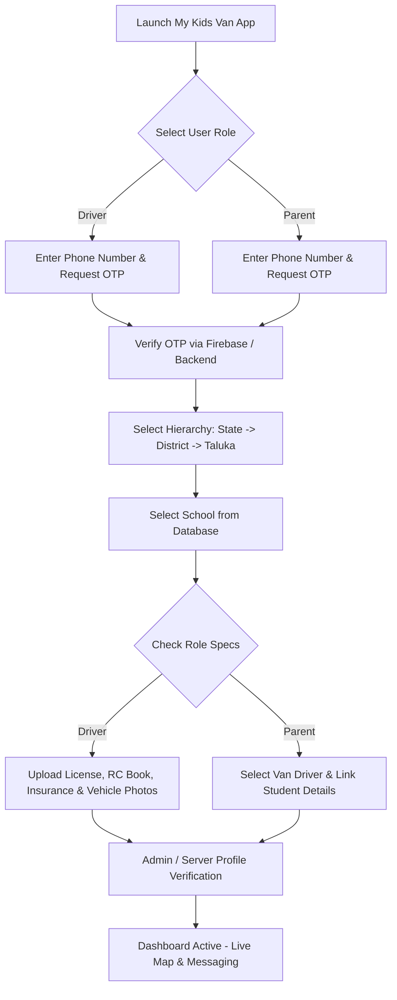
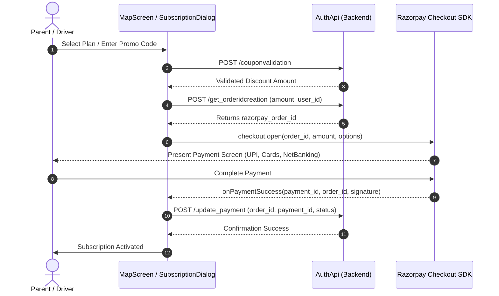

# 🚐 My Kids Van — Real-Time School Transport & Student Tracking System

[](https://developer.android.com/)
[](https://kotlinlang.org/)
[](https://developer.android.com/jetpack/compose)
[](https://kotlinlang.org/docs/multiplatform.html)
[](#-license--contact)

> **A Next-Generation Kotlin Multiplatform & Jetpack Compose Solution for Real-Time School Van Tracking, Safety Monitoring, Parent-Driver Communication, and Payment Management.**

---

## 📖 Table of Contents
1. [Key Features & Highlights](#-key-features--highlights)
2. [Visual Demos & Workflow Media Guidelines](#-visual-demos--workflow-media-guidelines)
3. [App Architecture & Tech Stack](#-app-architecture--tech-stack)
4. [Core Workflows & System Architecture Diagrams](#-core-workflows--system-architecture-diagrams)
5. [Project Directory Structure](#-project-directory-structure)
6. [API Endpoints Overview](#-api-endpoints-overview)
7. [Setup & Installation Guide](#-setup--installation-guide)
8. [Testing & Verification](#-testing--verification)
9. [Security & Data Protection](#-security--data-protection)
10. [Future Roadmap](#-future-roadmap--kmp-expansion)
11. [License & Support](#-license--contact)

---

## 🌟 Key Features & Highlights

- 📍 **Precision Real-Time GPS Tracking**: Powered by Google Maps Compose SDK, Fused Location Provider, Kalman Filter signal noise reduction, and dynamic bearing calculations.
- ⚡ **Background Location Tracking Service**: Robust Android Foreground Service (`LocationTrackingService`) maintaining persistent GPS sampling with status bar speed gauge and notifications.
- 👨‍👩‍👧 **Multi-Role Ecosystem**: Customized dashboards for **Parents**, **School Drivers**, and **School Administrators**.
- 💬 **In-App Messaging & Dynamic Alerts**: Real-time communication channels between Parents and Drivers with FCM push notifications and inline action receivers.
- 💳 **Razorpay Payment Gateway Integration**: Automated subscription billing, order creation API, driver/parent commissions, and wallet payout withdrawals.
- 🏢 **Multi-Tiered School Registry**: State → District → Taluka → School hierarchical mapping for automated driver & student assignment.
- 🔔 **Smart Push Notifications**: Firebase Cloud Messaging (FCM) integration for trip start/stop alerts, arrival notifications, and payment receipts.
- 🎙️ **Voice Assistance**: Built-in Text-to-Speech (`VoiceAssistant`) audio prompts informing users when vehicle movement or tracking begins/stops.
- 📂 **Digital Document Verification**: Driver license, RC, insurance, and vehicle photo upload pipeline with verification approval statuses.

---

## 🎨 Visual Demos & Workflow Media Guidelines

Below are the key app screens, user journeys, and architecture flows. Replace these placeholders with your recorded media files or exported GIFs.

```
┌─────────────────────────────────────────────────────────────────────────────────────────────┐
│                                    MY KIDS VAN APP PREVIEW                                  │
├───────────────────────────────┬───────────────────────────────┬─────────────────────────────┤
│      Splash & Role Select     │    Live Van GPS Tracking      │     Driver/Parent Chat      │
│  [ Demo GIF Placeholder ]     │   [ Live Map GIF Placeholder ]│ [ Chat Video Placeholder ]  │
│                               │                               │                             │
│       (splash_demo.gif)       │       (map_tracking.gif)      │       (chat_demo.gif)       │
└───────────────────────────────┴───────────────────────────────┴─────────────────────────────┘
```

### 📺 Workflow Video & GIF Asset Mapping
| Workflow Demo | Description | Recommended Media Path |
| :--- | :--- | :--- |
| **Parent Live Tracking** | Real-time map movement, speed gauge, radar timer, and polyline route | `docs/media/parent_tracking.gif` |
| **Driver Location Streaming** | Driver starting trip, foreground service notification, background GPS streaming | `docs/media/driver_streaming.gif` |
| **Registration & School Mapping** | Step-by-step dropdowns (State → District → Taluka → School) | `docs/media/registration_flow.mp4` |
| **In-App Messaging Flow** | Parent messaging driver, push notification alert, interactive reply | `docs/media/messaging_demo.gif` |
| **Subscription & Razorpay Checkout** | Razorpay SDK payment trigger, coupon validation, digital receipt | `docs/media/payment_checkout.gif` |

---

## 🏗️ App Architecture & Tech Stack

The project follows **Clean Architecture** principles in a **Kotlin Multiplatform (KMP)** project layout using **Unidirectional Data Flow (UDF)** with Jetpack Compose and `StateFlow`.

```
                        ┌──────────────────────────────────────────┐
                        │              Presentation                │
                        │   (Jetpack Compose M3, Animated Nav)     │
                        └────────────────────┬─────────────────────┘
                                             │
                                             ▼
                        ┌──────────────────────────────────────────┐
                        │             ViewModels                   │
                        │  (AuthViewModel, LatLngViewModel, etc.)  │
                        └────────────────────┬─────────────────────┘
                                             │
                                             ▼
                        ┌──────────────────────────────────────────┐
                        │             Domain / Repository          │
                        │  (AuthRepository, LatLngRepository)      │
                        └──────────────┬───────────────────────────┘
                                       │
                ┌──────────────────────┴──────────────────────┐
                ▼                                             ▼
    ┌───────────────────────────┐                 ┌──────────────────────────┐
    │     Data / Remote API     │                 │    Local Persistence     │
    │  Retrofit 2, OkHttp       │                 │  DataStore Preferences   │
    │  Ktor WebSockets          │                 │  (Session, Tokens, Role) │
    └───────────────────────────┘                 └──────────────────────────┘
```

### 🛠️ Tech Stack Matrix
| Layer | Technologies & Frameworks |
| :--- | :--- |
| **Language & Platform** | Kotlin 2.0+, Kotlin Multiplatform (KMP), Java 8 Target |
| **UI Framework** | Jetpack Compose (Material3), Accompanist (Permissions, Insets, Pager, Nav Animations) |
| **Architecture / DI** | MVVM, Koin Dependency Injection (DI) (`koin-android`, `koin-androidx-compose`) |
| **Maps & Location Engine**| Google Maps Compose SDK, Play Services Location (`FusedLocationProviderClient`), `SimpleKalmanLatLong` |
| **Networking** | Retrofit 2, Gson Converter, OkHttp 4 Logging Interceptor, Ktor Client OkHttp & WebSockets |
| **Reactive Pipelines** | Kotlin Coroutines, StateFlow, SharedFlow, SupervisorJob |
| **Push & Notifications** | Firebase Cloud Messaging (FCM), LocalBroadcastManager, Custom Notification Actions |
| **Payment Gateway** | Razorpay Android Checkout SDK (v1.6.40) |
| **Local Storage** | Jetpack DataStore Preferences |
| **Images & Animation** | Coil Compose (v2.4.0), Lottie Compose (v6.0.0) |
| **In-App Updates** | Google Play In-App Updates (`app-update-ktx`) |

---

## 🔄 Core Workflows & System Architecture Diagrams

### 1. Real-Time GPS Tracking Lifecycle
The sequence below demonstrates how raw GPS data moves from the **Driver Device** through filtering and the **Backend Server** to the **Parent Device**:



---

### 2. User Onboarding & School Assignment Workflow



---

### 3. Payment Gateway & Subscription Flow



---

## 📁 Project Directory Structure

```
MyKidsVan/
├── androidApp/                         # Primary Android App Module
│   ├── build.gradle.kts                # Android build configs & dependencies
│   └── src/main/
│       ├── AndroidManifest.xml         # Permissions, Foreground Service & Receivers
│       ├── assets/
│       │   └── congrats.json           # Lottie animation asset
│       └── java/com/vihaanshika/mykidsvan/android/
│           ├── Application.kt          # Application Entry & Koin DI Startup
│           ├── MainActivity.kt         # Single-Activity Container & Razorpay Listener
│           ├── MyApplicationTheme.kt   # Material 3 Color Schemes & Styling
│           ├── data/                   # Data Layer
│           │   ├── AuthApi.kt          # Retrofit REST API Endpoints
│           │   ├── AuthRepository.kt   # Repository Interface
│           │   ├── AuthRepositoryImpl.kt# Repository Implementation
│           │   ├── AuthViewModel.kt    # User Auth, Signup & Profile ViewModel
│           │   ├── MessagesViewModel.kt# Messaging ViewModel
│           │   └── dto/                # Data Transfer Objects
│           │       ├── request/        # Request Payloads (30+ DTOs)
│           │       └── response/       # Server Responses (30+ DTOs)
│           ├── di/
│           │   └── appModule.kt        # Koin Modules (Retrofit, DataStore, ViewModels)
│           ├── ui/                     # UI Layer (Jetpack Compose)
│           │   ├── LoginScreen.kt      # Phone/Password Authentication
│           │   ├── ParentSignupScreen.kt# Parent Registration Flow
│           │   ├── DriverSignupScreen.kt# Driver Registration & Vehicle Setup
│           │   ├── ProfileScreen.kt    # User Profile & Subscription Status
│           │   ├── ChatScreen.kt       # Real-Time Chat Screen
│           │   ├── MessageScreen.kt    # Chat List & Announcements
│           │   ├── SchoolRegistrationScreen.kt # School Selection Hierarchy
│           │   ├── UploadDocumentsScreen.kt    # License, RC, Insurance Uploader
│           │   ├── VehicleDetailsScreen.kt     # Vehicle Specs & Photos
│           │   ├── WithDrawRequests.kt # Wallet Balance & Commission Payouts
│           │   └── tracking/           # GPS Real-Time Engine
│           │       ├── LocationTrackingService.kt # Foreground Location Service
│           │       ├── MapScreen.kt    # Google Maps Compose View & Route Polyline
│           │       ├── LatLngViewModel.kt # GPS state, Kalman Filter & Speedometer
│           │       ├── SimpleKalmanLatLong.kt # GPS signal noise reduction algorithm
│           │       ├── VoiceAssistant.kt # Text-to-Speech audio cues
│           │       └── RadarTimerWithProgress.kt # Polling radar animation
│           └── utils/                  # Utility Helpers
│               ├── APIEndpoints.kt     # Server Route Constants
│               ├── Constants.kt        # Application Constants
│               ├── FirebaseMessagingService.kt # FCM Push Handler
│               ├── NotificationActionReceiver.kt # Notification Action Intent Handler
│               ├── Routes.kt           # Navigation Routes
│               └── UserPreferences.kt # Jetpack DataStore Session Storage
│
├── shared/                             # Kotlin Multiplatform Module
│   ├── build.gradle.kts
│   └── src/
│       ├── androidMain/                # Android Specific Platform Impl
│       ├── commonMain/                 # Common KMP Business Logic
│       └── iosMain/                    # iOS Specific Platform Impl
│
├── build.gradle.kts                    # Project Root Build Script
├── settings.gradle.kts                 # Project Modules Declaration
└── secrets.properties                  # Local Secret Keys (Not in Git)
```

---

## ⚙️ Setup & Installation Guide

### Prerequisites
- **Android Studio**: Ladybug / 2024.2.1 or newer.
- **JDK**: Version 17 (recommended for modern Gradle compatibility).
- **Target SDK**: API 36 (Min SDK 26).
- **Google Cloud Platform**: Account with **Google Maps SDK for Android** enabled.
- **Razorpay**: Dashboard account for test & live credentials.

---

### Step 1: Clone the Repository
```bash
git clone https://github.com/Bhushan2000/mykidvan.git
cd MyKidsVan
```

### Step 2: Configure `secrets.properties`
Create a file named `secrets.properties` in the root folder (`/secrets.properties`):

```properties
MAPS_API_KEY=AIzaSyYourGoogleMapsApiKeyHere
RAZORPAY_ID=rzp_test_YourRazorpayKeyId
RAZORPAY_SECRET=YourRazorpaySecretKey
```

### Step 3: Firebase Setup (`google-services.json`)
1. Download `google-services.json` from your Firebase Console.
2. Place `google-services.json` into the `androidApp/` directory:
   ```
   androidApp/google-services.json
   ```

### Step 4: Build & Run
Using Gradle Wrapper or Android Studio UI:
```bash
# Clean and compile debug build
./gradlew clean :androidApp:assembleDebug

# Deploy directly to connected physical device or emulator
./gradlew :androidApp:installDebug
```

---

## 🧪 Testing & Verification

| Command | Scope |
| :--- | :--- |
| `./gradlew test` | Runs unit tests across view models, repositories, and Kalman filtering |
| `./gradlew lint` | Performs code syntax, layout performance, and Android resource checks |
| `./gradlew assembleRelease` | Validates release build compilation and packaging |

---

## 🔐 Security & Data Protection

- **Protected API Credentials**: Sensitive secrets (`MAPS_API_KEY`, `RAZORPAY_ID`) are loaded dynamically from `secrets.properties` into `BuildConfig` and Manifest placeholders to ensure keys are not checked into source repositories.
- **HTTPS Enforcement**: Network communication uses strict SSL/TLS encryption (`https://avschoolerp.com/`).
- **Optimized Background GPS Sampling**: The `LocationTrackingService` restricts GPS collection frequency to 5-second intervals with high-accuracy jitter filtering (< 2 meters skipped) to prevent battery drain while respecting user privacy.
- **DataStore Session Storage**: Persistent user credentials and tokens are stored in private Jetpack DataStore Preferences files.

---

## 🚀 Future Roadmap & KMP Expansion

- [ ] **Native iOS App**: Extend the `shared` KMP module with SwiftUI UI bindings for iOS devices.
- [ ] **Offline Route Caching**: Retain polyline paths locally when driving through low-coverage network zones.
- [ ] **Geofencing Proximity Alerts**: Automatic notification when the school van arrives within 500 meters of the student pickup point.
- [ ] **AI-Driven ETA Estimation**: Historical traffic speed analysis to predict exact drop-off timings.

---

## 📄 License & Contact

Copyright © 2025 **Bhushan Tech Solutions**. All rights reserved.


